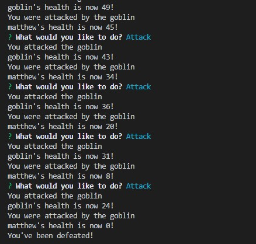

<h1 align="center">Jest Another RPG</h1>

<p align="center">
    
    
    
</p>  
  
<p align='center'>
    
</p>


## Table of Contents
- [Description](#description)
- [Installation](#install)
- [Usage](#usage)
- [Github](#github)
- [Questions](#questions)

## Description
Jest Another RPG is a fun quick RPG that takes place in the terminal. 
  
## Install
In the terminal run
```
npm install
```

## Usage
Once installed
```
node app.js
```
## Github 
[Jest Another RPG Repo](https://github.com/mattkohl82/jest-another-rpg)


## Questions
#### [Mattkohl82 for GitHub](https://github.com/Mattkohl82)   
#### mattkohl82@gmail.com for ✉️ email 
